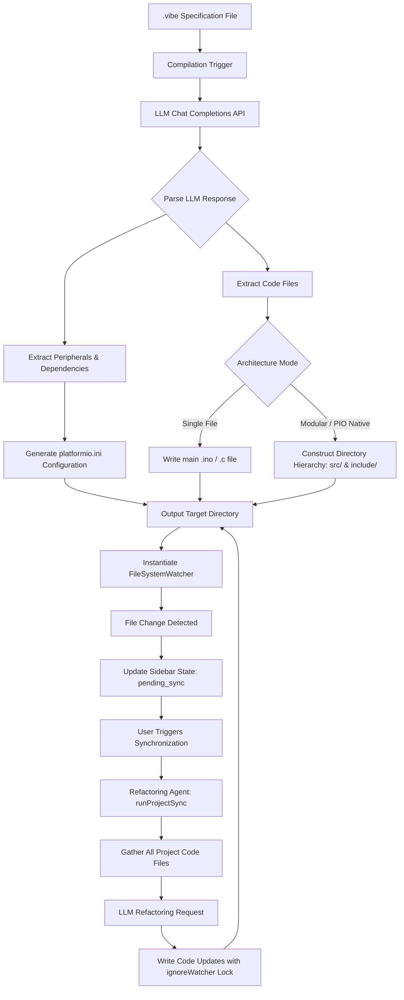

# vibeC VS Code Extension


vibeC is an intent-driven development framework and Visual Studio Code extension that transpiles high-level behavioral specifications written in plain natural language (contained within `.vibe` files) into compilable C/C++ architectures. The compiler uses Large Language Models (LLMs) to synthesize target code, resolve hardware component wiring conflicts, and execute automated synchronization routines across generated codebases.

---

## Technical Architecture Overview

The following diagram illustrates the flow from specification compilation to multi-file code generation and real-time project synchronization.



---

## Directory Topology

Depending on the chosen architecture settings, vibeC constructs either a single flat output file or a fully structured PlatformIO project layout:

### 1. Single File Structure
When compiling in `Single File` mode, the output matches the following layout:
```
workspace-root/
├── project_spec.vibe
├── project_spec.ino            # Compiled C/C++ source file (or .c in Standard C mode)
└── platformio.ini              # Generated environment setup configuration
```

### 2. Modular C++ / PlatformIO Native Project Structure
When compiling in modular layouts (`modular` or `pio_native`), vibeC encapsulates the system inside a dedicated workspace directory named after the `.vibe` source file:
```
workspace-root/
├── project_spec.vibe           # Original specifications file
└── project_spec/               # Target workspace subdirectory
    ├── platformio.ini          # Configured target environment, including lib_deps
    ├── SPECIFICATION.md        # Technical specification document (if generated)
    ├── include/                # Header file repository
    │   ├── AppEngine.h         # Core OOP header containing class structure definition
    │   └── [Module].h          # Extracted component headers (e.g. Display.h, Sensor.h)
    └── src/                    # Source file repository
        ├── main.cpp            # Entrypoint file instantiating the AppEngine loop
        ├── AppEngine.cpp       # Core engine execution routines
        └── [Module].cpp        # Component implementation source files
```

---

## Operational Workflows


### 1. The Compilation Phase
1. **Validation:** The extension verifies the open file extension (`.vibe`), confirms an active VS Code workspace is open, and validates the configuration namespace (`vibeC.apiKey`).
2. **API Dispatch:** The specification is bundled with platform-specific system instructions (e.g., memory optimization parameters for AVR, networking configurations for ESP32) and sent to the configured OpenAI-compatible completions endpoint.
3. **Extraction & File I/O:**
   - **Metadata Extraction:** The compiler isolates the `<vibe_meta>` tag structure, extracting external dependencies (mapped to `lib_deps` inside the generated `platformio.ini`) and physical wiring parameters (rendered inside the sidebar configuration map).
   - **File Construction:** In modular modes, the contents wrapped inside `<vibe_files>` tags are parsed, splitting file payloads by delimiter headers (`--- FILE: <path> ---`) and creating the nested directory hierarchy.

### 2. File Modification & Change Detection
Upon successful modular compilation, a `FileSystemWatcher` is registered over the target directory pattern `**/*.{cpp,h,ini}`:
1. **Change Interception:** When a user modifies a generated file, the watcher intercepts the write.
2. **Debounce and Status Push:** The watcher debounces incoming changes for 1.5 seconds, then notifies the sidebar webview using `postAgentState('pending_sync', fileName)`.
3. **UI Transition:** The AI Agent Terminal sidebar component transitions to the `Pending Sync` state, changing the status badge to a flashing amber indicator and altering the sync button contextually to "Run Sync".

### 3. Asynchronous Project Refactoring
When the user triggers synchronization from the Sidebar Terminal:
1. **State Transition:** The sidebar is placed in the `syncing` state, disabling interactive buttons and initializing the terminal log buffer.
2. **Source Aggregation:** The backend compiles all existing `.cpp` and `.h` source code blocks from the generated directory structure.
3. **LLM Synthesis:** The current codebase is sent to the refactoring model. The model identifies signature changes, variable inconsistencies, or out-of-sync declarations, outputting the necessary file modifications.
4. **File System Update with Watcher Suspension:** To prevent recursive trigger loops, the watcher flag `ignoreWatcher` is set to `true`. Files are updated, progress logs are appended to the Sidebar console in real-time, and the watcher lock is subsequently released. The UI state is finally reset to `idle`.

---

## AI Agent Terminal Subsystem Deep Dive

The vibeC AI Agent Terminal serves as a localized control terminal integrated directly within the sidebar webview. It coordinates refactoring operations when workspace source files diverge from their initial design declarations.

### Event-Driven Mechanics
The system utilizes a structured event-driven lifecycle to safely monitor, process, and execute updates:
1. **Interception:** A dedicated VS Code `FileSystemWatcher` continuously monitors files matching the workspace-specific pattern `**/*.{cpp,h,ini}`. When a file write is committed, the watcher captures the target file URI.
2. **Debounce Stabilization:** To prevent multiple concurrent updates during rapid keystrokes or IDE auto-save routines, the file mutation signals pass through a debouncing pipeline. An internal timer delays notification by exactly `1500ms`. If another file modification is intercepted before this timer expires, the previous timer is discarded and reset.
3. **State Push & UI Notification:** Once the stabilization timer expires, the backend issues an IPC post message (`agentStateChanged`) to the sidebar webview. The terminal UI changes state to `pending_sync`, rendering the visual flashing amber badge and updating the context button.
4. **Non-Destructive Refactoring Loop:** When the user clicks the sync button, the extension gathers the absolute content of all source code files within the project. It sends this state to the LLM backend alongside refactoring prompts to correct signature mismatches and broken links in dependencies. The returned modifications are parsed and written back to disk non-destructively, preserving manual file creations while aligning declaration mismatches.

---

## Technical Features

### 1. Hardware Pin Validation Rules
The extension incorporates real-time electrical layout validation directly inside the webview rendering layer:
- **Conflict Detection:** If multiple distinct components claim the same physical hardware pin (excluding common power references like `VCC`, `GND`, `3V3`, `5V`), the UI flags the pin with a high-priority warning: `⚠️ CONFLICT!`.
- **Strapping Pin Guard:** When compiling targeting the ESP32 platform, the rendering engine verifies the output pin assignments against known hardware strapping pins (`GPIO 0`, `GPIO 1`, `GPIO 3`, `GPIO 5`, `GPIO 12`, `GPIO 15`). If a component uses a strapping pin, the UI raises a warning badge: `⚠️ STRAPPING PIN!`, protecting developers from boot-sequence failures.

### 2. PlatformIO Environment Injection
vibeC automatically configures a functional developer environment:
- **Target Platform Injection:** Depending on the selected target, the compiler generates a fully structured `platformio.ini` in the project root:
  - **ESP32:** Configures `platform = espressif32`, `board = esp32dev`, and `framework = arduino`.
  - **AVR:** Configures `platform = atmelavr`, `board = uno`, and `framework = arduino`.
- **Dependency Integration:** The external library requirements parsed from the model's `<vibe_meta>` block are translated directly into the configuration as separate, clean lines inside the `lib_deps` setting block.

### 3. Concurrency & Synchronization State Locks
To ensure operational stability and prevent recursion loops, the extension implements locks at both the backend and frontend:
- **ignoreWatcher Lock:** An internal boolean flag `ignoreWatcher` is managed within the extension scope. During automated file writes by the synchronization agent, `ignoreWatcher` is set to `true`. This instructs the active `FileSystemWatcher` to ignore the filesystem writes, eliminating infinite-loop refactoring cascades. Once files are written, `ignoreWatcher` is restored to `false` within a `finally` safety block.
- **UI Interaction Lock:** When the terminal is in a `syncing` state, all compilation and refactoring controls (including `#compileBtn` and `#agentSyncBtn`) are disabled, ensuring execution runs to completion before a new request is initialized.

---

## Technical Configuration Namespace

The extension settings namespace resides under `vibeC` configuration properties:

| Configuration Parameter | Data Type | Default Value | Description |
| :--- | :--- | :--- | :--- |
| `vibeC.apiKey` | String | `""` | Bearer authentication token for authorization with the completions provider. |
| `vibeC.apiUrl` | String | `https://api.groq.com/openai/v1/chat/completions` | Fully qualified URL routing requests to the target completions API. |
| `vibeC.modelName` | String | `llama-3.3-70b-versatile` | The target model identifier passed inside the request body payload. |

---

## Troubleshooting

| Incident / Symptom | Root Cause | Remediation Procedure |
| :--- | :--- | :--- |
| **IntelliSense errors** (undefined headers or syntax highlighting markers) in VS Code editor. | VS Code IntelliSense is referencing the global workspace folder instead of the generated project directory subfolders. | Run the PlatformIO Rebuild IntelliSense Index command, or open the generated project subdirectory directly as the workspace root. |
| **File watcher infinite loops** (sync loop executes repeatedly after write lock releases). | The `ignoreWatcher` concurrency lock is not engaged, causing filesystem writes from the refactoring routine to trigger the watcher. | Ensure that `ignoreWatcher` is set to `true` immediately before filesystem writes in `runProjectSync` and returned to `false` in a `finally` block. |
| **API Connection Timeout / Post Failures.** | High latency or connection drop-offs on the completions endpoint (timeout set to 120,000ms). | Verify network routing, validate configuration values for `apiUrl` and `apiKey`, and check the service status of the completions provider. |
| **Missing/Malformed Hardware Configuration Map.** | The LLM failed to output a structurally correct `<vibe_meta>` JSON block or omitted the closing tag entirely. | Recompile the `.vibe` source. Ensure the specification file clearly requests hardware integrations, prompting the LLM to output peripheral details. |
